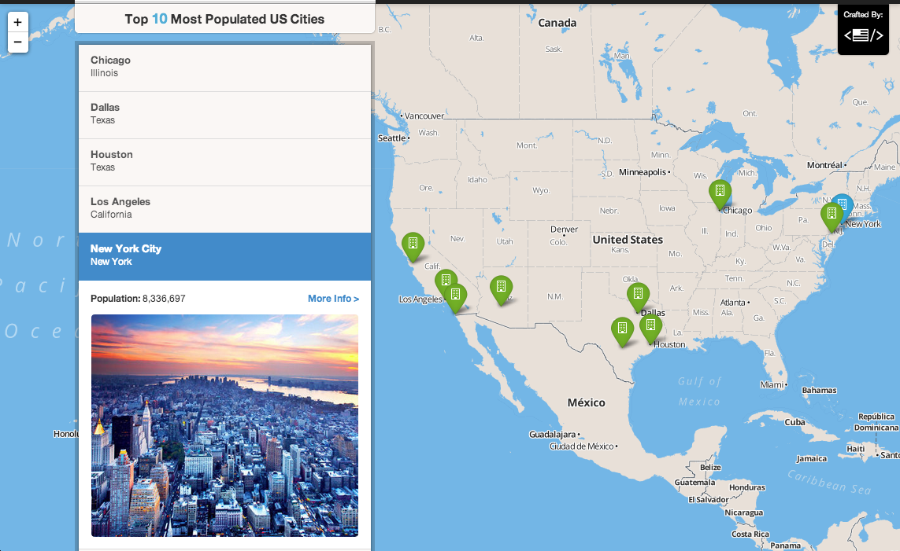

jekyllmap
=========

A simple jekyll site that generates a map!

Installation
-------------
    git clone https://github.com/dthompson/jekyllmap.git
    jekyll serve

Adding Locations
-----------------
Locations are located in the `location/` folder as .txt files, supporting images reside in `images/`. Jekyll will compile all text files by default regardless of filename, so long as the file has a [yaml structure](http://rhnh.net/2011/01/31/yaml-tutorial).

The text file **must** be structured as follows:

    ---
    layout: location
    latitude: 37.776368
    longitude: -122.408594

    title: Name of Point
    address: Location Details					# optional
    info: Info Line for Point Reveal Effect 	# optional
    image: "image_file_name.jpg"				# optional

    tags:										# optional
    - these
    - are the
    - specific point's
    - optional features
    ---

Latitude and longitudal coordinates can be found via [Google Maps](http://universimmedia.pagesperso-orange.fr/geo/loc.htm).

Options
---------
As you might be able to tell, quite a bit is optional and there is plenty of room to add/remove additional variables if needed.

**Required** to properly plot a point:

    layout: location
    latitude: #
    longitude: #

The `title: ` option gives a title to the listed point while `address: ` and `info: ` provide additional details to filter the points.

Modifying the Map
------------------
Feel free to change any functionality. 

All that is provided by default is an index page `index.html` which plots all points as well as a location specific page which resides in `_layouts/location.html`. All mapping functionality for the index page resides in `assets/js/mapping.js`.